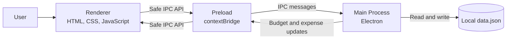

# Expense Tracker

Expense Tracker is a private desktop app for recording everyday purchases and staying within a daily, weekly, or monthly budget. Your data stays on your computer; no account or online service is required.

## What You Can Do

- Set a spending budget for the period that suits you.
- Add expenses with an amount, category, and optional description.
- See how much of your budget is spent and what remains.
- Review transactions by day, week, month, or across all time.
- Receive an alert when spending exceeds the selected budget.

## How It Works

The application uses Electron's secure three-process model. The renderer provides the interface, the preload script exposes a small safe API, and the main process owns and stores budget and expense data locally.



## Launch From Source

Install a recent Node.js version, then run the following commands from the project folder.

### Windows

```powershell
git clone https://github.com/samuelchang951222/expense-tracker.git
cd expense-tracker
npm install
npm start
```

### macOS

```sh
git clone https://github.com/samuelchang951222/expense-tracker.git
cd expense-tracker
npm install
npm start
```

To create an installable package instead, run `npm run build:win` on Windows or `npm run build:mac` on macOS. Generated files are placed in `dist`.

## License

MIT
